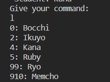
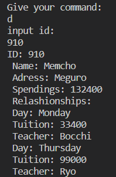
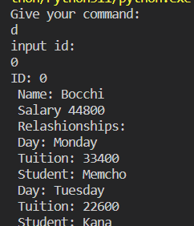

## TASK
Make a tutor management system.

### Entities

#### User
All users have
* id (integer)
* name

There are 2 types of users: **Teachers** and **Students**

#### Students
All students hold several **Subjects** and corresponding **teacher** for each subject.  
  
Each **student-teacher relashionship** has data below: 
* Day of week (Monday-Sunday)
* Tuition fee (integer)  
Day of week for students never duplicate with another subject.  
(=Students cannot learn more than 1 subject per day)

Students have their **adress** where teachers go to teach.  
We also hold all individual student's **spent money** for us.

#### Teachers
All teachers have **student-teacher** relashionship same as above.  
Teachers cannot learn more than 1 subject per day.  
  
Teachers has single **salary rate**(0.0-1.0) which indicates that how much persentage of the tuition teachers can get as salary.
  
We also hold all individual teacher's **salary** from us.

#### Subjects
Subjects are **recognized by name**.
Subject names are not pre-defined.

### Functional Requirements
All requests are made by keyboard command.  
Use
```
command = input()
```
to get command from user.

#### Load Data
JSON data is in `data.json`.  
You may use
```
import json
with open('data.json') as file:
	data_dictionary = json.load(file)
```

#### Users list
By command `l` show all the names and id. Ascending order by the ID.



#### Company income check
By command `i`, calculate the company income.  
  
(Company income) = (Tuition from all teachings) - (Salary to all teachers)

#### User detail
By command `d`, ask the id wanted from the user.
Then show the detail of the user as below.

* Student  


* Teacher  
